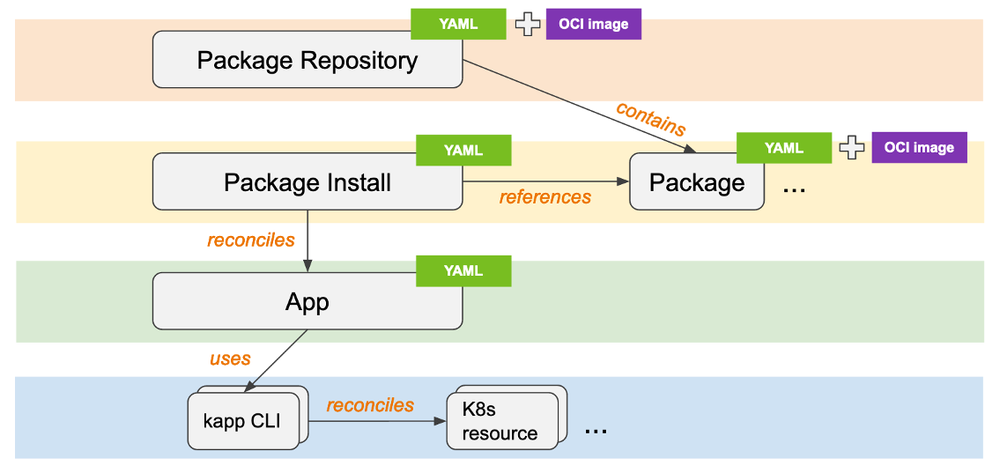

TAP is available through pre-defined **profiles** or individual packages. These profiles are designed to simplify the installation experience and expedite the time to getting started with the platform and are implemented via nested PackageInstalls.

The relevant documentation can be found in the TAP product documentation here:
```dashboard:open-url
url: {{ ENV_TAP_PRODUCT_DOCS_BASE_URL }}/GUID-install.html#install-your-tanzu-application-platform-profile-1
```

With the current version of TAP (1.1), there are the following profiles available:
- **Full**: This profile contains all of the Tanzu Application Platform packages 
- **Iterate**: This profile is intended for iterative application development.
- **Build**: This profile is intended for the transformation of source revisions to workload revisions. Specifically, hosting workloads and SupplyChains.
- **Run**: This profile is intended for the transformation of workload revisions to running pods. Specifically, hosting deliveries and deliverables.
- **View**: This profile is intended for instances of applications related to centralized developer experiences. Specifically, the TAP GUI and Metadata Store.

For the installation via profiles, you have to create a configuration file (`tap-values.yml`) that includes configuration for all the components that are part of the profile and not excluded (which is possible with the `excluded_packages` configuration).
Here is an example for the full profile without TLS configuration:
```editor:append-lines-to-file
file: tap-values.yaml
text: |
  profile: full
  ceip_policy_disclosed: true
  buildservice:
    kp_default_repository: registry.example.com/tap/build-service
    kp_default_repository_username: admin
    kp_default_repository_password: <password>
    tanzunet_username: user@example.com
    tanzunet_password: <password>
    enable_automatic_dependency_updates: true
    descriptor_name: full
  supply_chain: testing_scanning
  ootb_supply_chain_testing_scanning:
    registry:
      server: registry.example.com
      repository: tap-wkld
    gitops:
      ssh_secret: ""
  learningcenter:
    ingressDomain: learning-center.tap.example.com
  tap_gui:
    ingressEnabled: true
    ingressDomain: tap.example.com
    service_type: ClusterIP
    app_config:
      backend:
        baseUrl: http://tap-gui.tap.example.com
        cors:
          origin: http://tap-gui.tap.example.com
      app:
        baseUrl: http://tap-gui.tap.example.com
  metadata_store:
    app_service_type: ClusterIP
  contour:
    envoy:
      service:
        type: LoadBalancer
  accelerator:
    domain: tap.example.com
    ingress:
      include: true
      enable_tls: false
    server:
      service_type: ClusterIP
  cnrs:
    domain_name: cnr.tap.example.com
  grype:
    namespace: default
    targetImagePullSecret: registry-credentials
```

The installation can then be executed via
`tanzu package install tap -p tap.tanzu.vmware.com -v 1.1.0 --values-file tap-values.yml -n tap-install`

With the following command, you can see which packages were installed in the workshop cluster using the **PackageInstall** Custom Resource.
```terminal:execute
command: tanzu package installed list -n tap-install
clear: true
```
As an alternative you can also use the kubectl CLI. 
```terminal:execute
command: kubectl get packageinstalls -n tap-install
clear: true
```

With the current version of TAP it's **not possible to exclude tap-telemetry.tanzu.vmware.com as a package**. There is a section available in the documentation on how to disable it.

To get details for a package, e.g. the `USEFUL-ERROR-MESSAGE`, you can use the following commands.
```terminal:execute
command: tanzu package installed get tap -n tap-install
clear: true
```
```terminal:execute
command: kubectl describe packageinstalls tap -n tap-install
clear: true
```
With the eksporter krew plugin, it's easier to have a look at the spec, which references the Package CR, specifies a service account that will be used to install underlying package contents, and references a secret that includes values to be included in package's templating step.
```terminal:execute
command: kubectl eksporter packageinstalls tap -n tap-install
clear: true
```

You can also view the App CR created as a result of the PackageInstall creation via `kubectl tree packageinstalls tap -n tap-install` if you have the privileges.

And can have a closer look with.
```terminal:execute
command: kubectl describe app tap -n tap-install
clear: true
```

As a summary for package management with Carvel, here is a diagram that shows the relationship of all the CRDs we talked about in the last sections.


###### Overlays with PackageInstall
PackageInstalls expose the ability to customize package installation using annotations recognized by kapp-controller.

Since it is impossible for package configuration and exposed data values to meet every consumer’s use case, you have added an annotation that enables consumers to extend the package configuration with custom ytt paths.

The extension annotation is called `ext.packaging.carvel.dev/ytt-paths-from-secret-name` and can be suffixed with a .X, where X is some number, to allow for specifying it multiple times.

For example, `ext.packaging.carvel.dev/ytt-paths-from-secret-name.0: cnrs-network-config-overlay` will include the overlay stored in the secret cnrs-network-config-overlay during the templating steps of the package. 

```editor:append-lines-to-file
file: cnrs-network-config-overlay.yaml
text: |
  apiVersion: v1
  kind: Secret
  metadata:
    name: cnrs-network-config-overlay
  stringData:
    cnrs-network-config-overlay.yaml: |
      #@ load("@ytt:overlay", "overlay")
      #@overlay/match by=overlay.subset({"metadata":{"name":"config-network"}, "kind": "ConfigMap"})
      ---
      data:
        #@overlay/match missing_ok=True
        default-external-scheme: https 
```

Due to the fact that TAP is installed via nested PackageInstalls it's a little bit more complicated. You have to annotate the parent `tap` PackageInstall via e.g. `kubectl annotate packageinstalls tap -n tap-install ext.packaging.carvel.dev/ytt-paths-from-secret-name.0=tap-overlay-cnrs-network-config` and in the `tap-pkgi-overlay-cnrs-network-config` Secret define a PackageInstall overlay for the child package (in this case cnrs) as you can see in this example.
```editor:append-lines-to-file
file:  tap-overlay-cnrs-network-config.yaml
text: |
  apiVersion: v1
  kind: Secret
  metadata:
    name: tap-overlay-cnrs-network-config
  stringData:
    tap-overlay-cnrs-network-config.yml: |
      #@ load("@ytt:overlay", "overlay")

      #@overlay/match by=overlay.subset({"kind":"PackageInstall", "metadata":{"name":"cnrs"}})
      ---
      metadata:
        #@overlay/match missing_ok=True
        annotations:
          #@overlay/match missing_ok=True
          ext.packaging.carvel.dev/ytt-paths-from-secret-name.0: cnrs-network-config-overlay

      ---
      apiVersion: v1
      kind: Secret
      metadata:
        name: cnrs-network-config-overlay
      stringData:
        add-anns.yml: |
          #@ load("@ytt:overlay", "overlay")

          #@overlay/match by=overlay.subset({"metadata":{"name":"config-network"}, "kind": "ConfigMap"})
          ---
          data:
            #@overlay/match missing_ok=True
            default-external-scheme: https
```